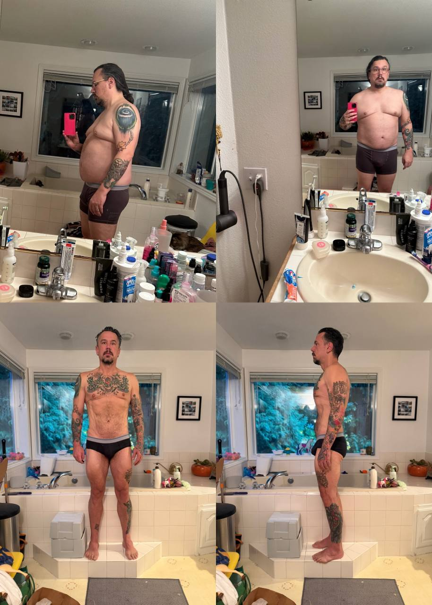
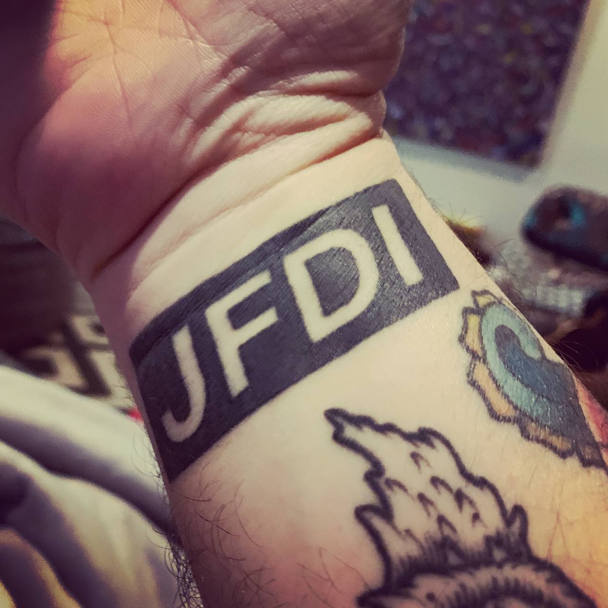
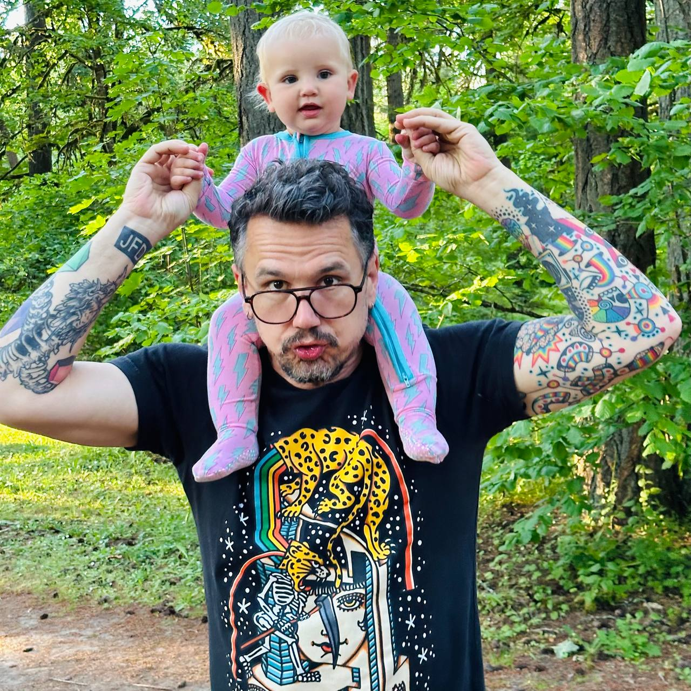
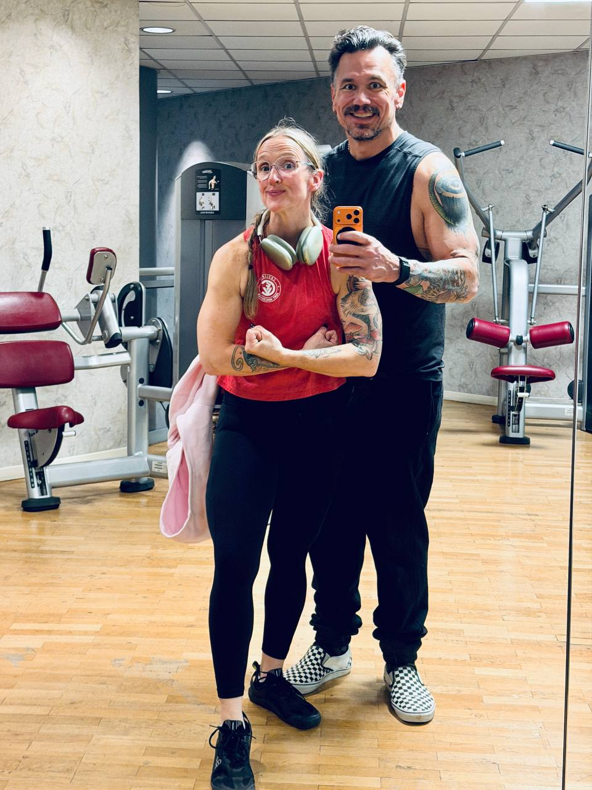
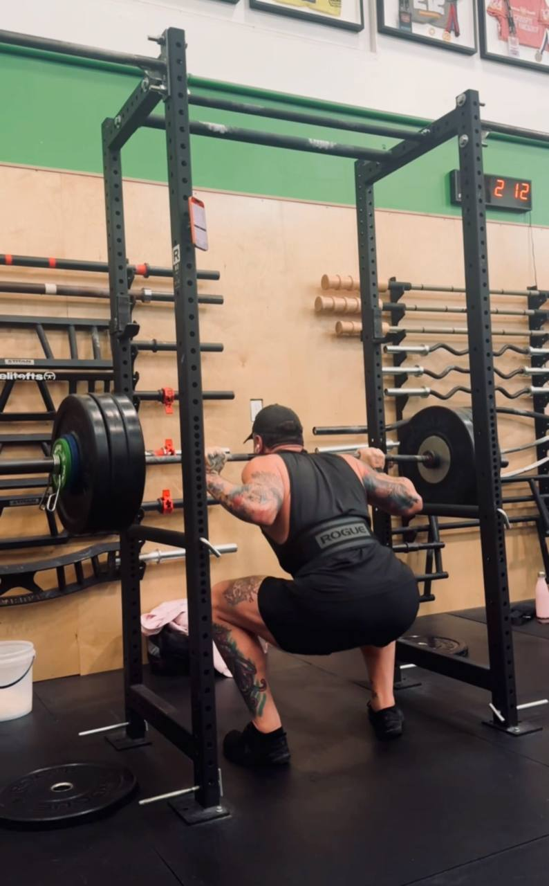
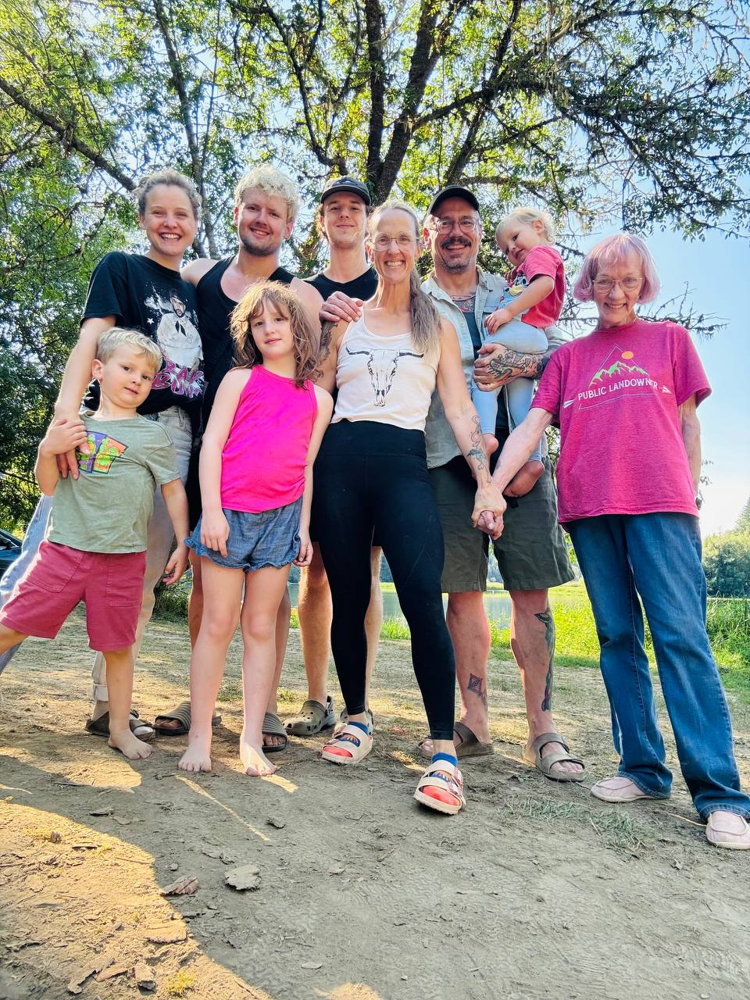

290 pounds and I couldn't walk and talk at the same time.

I'd pace during work meetings and get out of breath. Convinced myself something was seriously wrong — got tests, scans, the whole workup. Asthma? Lung cancer? Some horrible disease?

Nope. Just completely out of shape. That's it.

That hit different.

## The Commitment Problem

I've fought being overweight my entire life — literally since middle school when my mom had me on Weight Watchers as a pre-teen. Over the years I've tried it all: fad diets, calorie counting, macro tracking, [Eat to Live](https://amzn.to/49ORhcP) (which actually worked for a while — lost a bunch of weight but it all came back).

The pattern was always the same: find something, commit hard, see results, then life happens and it all unravels.

Here's what I've learned about myself: I'd rather not start than start and quit. Quitting is a habit too — and I'm not training that one.

I've read all the books. Tiny Habits. The Power of Habit. Atomic Habits. Productivity books for decades. I understand how habits work. And I know that creating commitments and then breaking them is exactly the wrong habit to build.

So I postpone. I wait until I'm actually ready to commit. Because once I commit, I don't want to break it.

This mindset came from running a business. When you bootstrap something and people depend on you — employees, customers, partners — commitment isn't optional. You show up or it fails. Alex Hillman and Amy Hoy taught me this. I've got [JFDI](https://dangerouslyawesome.com/2016/08/what-jfdi-really-means/) tattooed on my wrist for a reason.

But my body? Nobody was counting on that. No external accountability. So it kept sliding.

## Making It Non-Negotiable

At 50 you start watching the generation ahead of you get frail. I realized that's not inevitable — it's preventable — but the earlier you start, the better your odds.

Around the same time, I saw a TikTok from a doctor talking about fitness as preparation for aging. The idea: inevitably we'll get sick — cancer, a fall, whatever. But your survival odds improve dramatically based on the lifestyle choices you make today.

That was a paradigm shift.

Let me be clear though — I'm also vain as fuck. I want to be jacked. I want to look good naked while I still can. But the foundation is living well for as long as possible. Being active with my kids and grandkids. Enjoying this life instead of just surviving it.

I was 48, staring down 50, and decided I wanted to hit that milestone fit for the first time in my adult life. #FitFor50 was on.

The difference this time? It had to move from *a* priority to *the* priority. Non-negotiable. Because if it's negotiable, you'll negotiate your way out. I always had.

Travel used to be the killer. I'd be doing great, go out of town, and backslide completely. Hotel without a gym? Week off. Come home feeling like shit? Done. The backslide *became* the habit.

## Finding MyBodyTutor

I found [MyBodyTutor](https://www.mybodytutor.com) through Twitter — [Adam Wathan](https://x.com/adamwathan) was sharing his dramatic results and it caught my attention. I'm a big believer in coaching in general, so figured it was worth a shot.

Adam's not the type to hype up bullshit. If he was in, I trusted the program was legit. The only thing missing before was my own commitment.

I committed to a month. A week in, I knew I was in for a year.

When I started MBT I was annoyed. A call? Multiple calls? WEEKLY CALLS? What's this guy gonna want from me? What restrictive program am I going to be forced to follow?

That wasn't it at all.

Instead, my coach Walter asked where I was at and where I wanted to be. We talked about my love of [Sour Patch Kids](https://amzn.to/4qBpKCO). What I could do, what I was willing to do. We started with baby steps.

I'd been sitting on a 21-day hip opening yoga challenge I bought a year before — finally committed to doing it. Committed to walks around the block. Committed to tracking my food.

Humbling to log a Sour Patch Kid, but I could do it.

The difference? It's MY program, not Walter's. He's there to listen, encourage, answer questions, and help me find the right direction myself. No meal plans shoved down my throat. No guilt trips. Just consistent support while I figured out what actually works for my life.

And when I traveled? We'd come up with a plan. Find a place, find a way to get the activity. Keep the momentum moving. Otherwise it stops, backslides, and suddenly you've negated your commitment.

The mindset shift: occasional slips don't break the commitment. You keep going. Keep moving forward. Imperfection doesn't mean failure — stopping does.

## The Evolution

"What would happen if I did this for a year?"

That question changed everything. It removes the pressure of immediate results. It's not "is this the right program" — it's "what happens if I stop quitting?"

From walks and stretching, I got back into PT for my knee. My PT Kelly had me doing bodyweight Bulgarian split squats and I was DYING. Started lifting again in my garage — the PT and yoga were helping and I was running 5x5, making progress.

Kelly gently suggested CrossFit. I rolled my eyes. "That's fuckin crazy."

As it happens, Walter is a CrossFit instructor. He'd mention his work, gently suggest I might like it. Crazy! Not this guy. Exercise in FRONT of people?!

Then my wife Kristina started doing CrossFit.

Seven months into MBT, down 50 pounds, feeling great. I committed to a month — signed up for 5 onboarding sessions. That's where I met coach Hannah.

Those first sessions were like death. But I stuck it out. Did my first class. Uncomfortable — mentally and physically. Started going a few times a week.

"What would happen if I did this for a year?"

Worked up to 5 days a week. One day coach Colin said something that changed everything: "Instead of skinny, what if you got strong?"

Full paradigm shift.

The goal wasn't to be slight and trim. I want to be strong. Jacked. Powerful.

So I stopped eating in a severe deficit. After 450 days of tracking, I quit counting altogether. Gained some weight, but it was different. I was different.

## Finding My Place

CrossFit Fort Vancouver is one of my favorite places on earth. The coaches and friends fill my soul in a way I never expected — certainly not a result I anticipated from this journey.

A year and a half into CrossFit, I tried their Conjugate Strength program with coach Chris McDonald. Powerlifting focused.

"What if I did this for a year?"

A year in? I'm strong as fuck. Jacked even. It feels amazing. Powerful.

I've started rolling CrossFit back in — took almost a year to be able to do both, but I'm amazed I can.

What if I do conjugate AND CrossFit for a year?

I'm excited to find out.

## For Anyone On The Fence

I see people online wondering if it's "too late." It's not. It's absolutely not.

What you can accomplish with consistency — not perfection — is amazing.

I still eat Sour Patch Kids.

But the commitment and consistency have changed me at a fundamental level. I ran a business for years before I realized I needed to run my body the same way.

I also can't express enough how meaningful group fitness has been. I'm the least likely person to enjoy exercising in front of others, and I'm amazed every day just how profound it's been for me.

I've got so much gratitude for my coaches — Walter, Kelly, Hannah, Colin, Adam, Emma, and Chris — and the amazing community I get to be an active part of.

Life is good.
